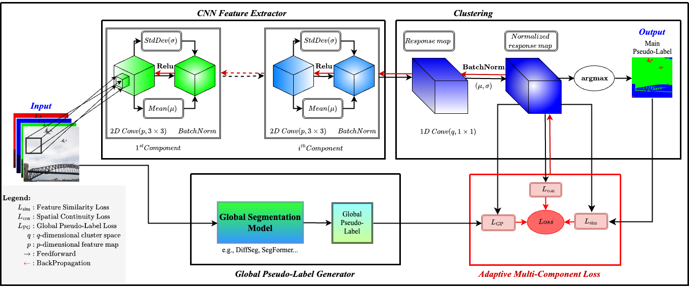

# DynaGuide

**A Generalizable Dynamic Guidance Framework for Zero-Shot Guided Unsupervised Semantic Segmentation**

[](https://doi.org/10.1016/j.imavis.2025.105770)
[](https://www.sciencedirect.com/journal/image-and-vision-computing)
[](LICENSE)
[](https://python.org)
[](https://pytorch.org)

<p align="center">
  
</p>

## 📄 Publication

**Image and Vision Computing**, Volume 164, December 2025, Article 105770

**Authors:** Boujemaa Guermazi, Riadh Ksantini, Naimul Khan

**DOI:** [10.1016/j.imavis.2025.105770](https://doi.org/10.1016/j.imavis.2025.105770)

---

## Highlights

- **Dual-Guidance Framework**: Combines static global pseudo-labels with dynamic local CNN refinement
- **Adaptive Multi-Loss**: Feature similarity + Huber-smoothed diagonal continuity + global guidance alignment
- **Flexible Guidance**: Works with unsupervised (DiffSeg) or supervised-pretrained (SegFormer) pseudo-labels
- **Lightweight**: Only **106.4K parameters** and **6.99 GFLOPs** — 183 FPS on CPU
- 📊 **State-of-the-Art**: +17.5% mIoU on BSD500, +3.1% on PASCAL VOC2012, +11.66% on COCO

---

## Abstract

Zero-shot guided unsupervised image segmentation enables dense scene understanding without relying on target-domain annotations, making it particularly valuable in domains where labeled data is scarce. However, most existing approaches struggle to reconcile global semantic coherence with fine-grained boundary precision.

**DynaGuide** introduces an adaptive segmentation framework that addresses this challenge through:
1. **Global pseudo-labels** from external models (DiffSeg or SegFormer) providing high-level semantic priors
2. **Local refinement** via a lightweight CNN trained from scratch, correcting noisy predictions and sharpening spatial detail
3. **Dynamic loss optimization** that balances feature similarity, Huber-smoothed spatial continuity (including diagonal), and semantic alignment

---

## Results

### BSD500

| Method | All | Fine | Coarse | Mean |
|--------|-----|------|--------|------|
| DiffSeg | 0.364 | 0.357 | 0.357 | 0.359 |
| DynaSeg-FSF | 0.349 | 0.307 | 0.420 | 0.359 |
| **DynaGuide (DiffSeg)** | **0.566** | **0.512** | **0.523** | **0.534** |
| **DynaGuide (SegFormer)** | **0.570** | **0.553** | **0.543** | **0.555** |

### PASCAL VOC2012

| Method | mIoU |
|--------|------|
| DiffSeg | 0.443 |
| DynaSeg-SCF | 0.396 |
| **DynaGuide (DiffSeg)** | **0.474** |
| **DynaGuide (SegFormer)** | **0.481** |

### COCO

| Method | COCO-All mIoU | COCO-Stuff mIoU | pAcc |
|--------|---------------|-----------------|------|
| DynaSeg-FSF | 30.51 | 54.10 | 81.1 |
| DiffSeg | - | 43.6 | 72.5 |
| **DynaGuide (DiffSeg)** | **42.18** | **45.6** | **73.6** |
| **DynaGuide (SegFormer)** | **52.38** | **55.2** | **82.4** |

### Computational Efficiency

| Method | Parameters | GFLOPs |
|--------|------------|--------|
| DINO + HP | 39.6M | 164.15 |
| STEGO | 86.6M | 67.42 |
| DynaSeg (CNN) | 0.19M | 9.75 |
| **DynaGuide** | **0.11M** | **6.99** |

**Runtime:** ~5.5ms per image (~183 FPS) on Intel Core i9-10920X CPU

---

## Installation

```bash
# Clone the repository
git clone https://github.com/RyersonMultimediaLab/DynaGuide.git
cd DynaGuide

# Create environment
conda create -n dynaguide python=3.10
conda activate dynaguide

# Install dependencies
pip install -r requirements.txt
```

---

## Quick Start

### Basic Usage

```bash
python train.py \
    --input_folder /path/to/images \
    --output_folder /path/to/output \
    --guidance diffseg \
    --visualize
```

### Using Presets

```bash
# BSD500
python train.py --input_folder ./data/BSD500 --output_folder ./output --preset bsd500

# PASCAL VOC2012
python train.py --input_folder ./data/VOC2012 --output_folder ./output --preset pascal_voc

# COCO
python train.py --input_folder ./data/COCO --output_folder ./output --preset coco
```

### Python API

```python
from dynaguide import DynaGuideNet
from dynaguide.pseudo_labels import DiffSegGuide, SegFormerGuide
from configs import DynaGuideConfig

# Initialize
config = DynaGuideConfig()
guidance = DiffSegGuide()  # or SegFormerGuide()

# Load image
from PIL import Image
image = Image.open("example.jpg")

# Generate pseudo-labels
pseudo_labels = guidance.generate(image)

# Initialize model (106.4K params)
model = DynaGuideNet(input_dim=3, n_channel=100, n_conv=3)
```

---

## Architecture

```
┌─────────────────────────────────────────────────────────────────────┐
│                         DynaGuide Framework                          │
├─────────────────────────────────────────────────────────────────────┤
│                                                                      │
│  Input Image ──┬──▶ Global Generator ──▶ Pseudo-labels (Ŝ)          │
│                │    (DiffSeg/SegFormer)      │                       │
│                │                              │                       │
│                └──▶ CNN Feature Extractor ◀──┘                       │
│                     (3 Conv blocks + Skip)                           │
│                            │                                         │
│                            ▼                                         │
│                     Response Map (R̂)                                 │
│                            │                                         │
│                            ▼                                         │
│                     Cluster Labels (Ĉ)                               │
│                                                                      │
├─────────────────────────────────────────────────────────────────────┤
│                    Adaptive Multi-Component Loss                     │
│                                                                      │
│   L = L_sim + (K̂/β) × [L_HPy + L_HPz + L_HD1 + L_HD2] + L_guide    │
│                                                                      │
│   • L_sim: Feature Similarity (CrossEntropy)                         │
│   • L_HP: Huber-smoothed Spatial Continuity (H, V)                  │
│   • L_HD: Diagonal Continuity (↘, ↙)                                │
│   • L_guide: Global Guidance Alignment                               │
└─────────────────────────────────────────────────────────────────────┘
```

---

## Loss Function

The total loss dynamically balances three components:

```
L_total = L_sim + (K̂/β) × L_spatial + L_guide
```

Where:
- **L_sim**: Cross-entropy for feature similarity clustering
- **L_spatial**: Huber loss for horizontal, vertical, and diagonal continuity
- **L_guide**: Cross-entropy alignment with global pseudo-labels
- **K̂**: Dynamic cluster count (starts at 100, converges to scene complexity)
- **β = 15**: Fixed scaling factor (no dataset-specific tuning required)

---

## Configuration

| Parameter | Default | Description |
|-----------|---------|-------------|
| `n_channel` | 100 | Feature/cluster dimension |
| `n_conv` | 3 | Number of conv blocks |
| `max_iter` | 1000 | Max training iterations |
| `lr` | 0.1 | Learning rate (SGD) |
| `momentum` | 0.9 | SGD momentum |
| `beta` | 15 | Spatial loss scaling |
| `guidance` | diffseg | Pseudo-label source |

---

## Evaluation

```bash
python -m evaluation.metrics \
    --gt_folder /path/to/ground_truth \
    --pred_folder /path/to/predictions \
    --output results.json
```

---

## Project Structure

```
DynaGuide/
├── dynaguide/
│   ├── __init__.py
│   ├── model.py              # DynaGuideNet (106.4K params)
│   ├── losses.py             # Adaptive multi-component loss
│   └── pseudo_labels.py      # DiffSeg, SegFormer, DINO generators
├── configs/
│   ├── __init__.py
│   └── default.py            # Configs + presets
├── evaluation/
│   ├── __init__.py
│   └── metrics.py            # mIoU, Hungarian matching
├── utils/
│   ├── __init__.py
│   ├── visualization.py
│   └── io.py
├── examples/
│   └── demo.py
├── train.py                  # Main training script
├── requirements.txt
├── LICENSE
└── README.md
```

---

## Citation

If you find this work useful, please cite:

```bibtex
@article{guermazi2025dynaguide,
  title={DynaGuide: A generalizable dynamic guidance framework for zero-shot guided unsupervised semantic segmentation},
  author={Guermazi, Boujemaa and Ksantini, Riadh and Khan, Naimul},
  journal={Image and Vision Computing},
  volume={164},
  pages={105770},
  year={2025},
  publisher={Elsevier},
  doi={10.1016/j.imavis.2025.105770}
}
```

---

## Related Work

- **[DynaSeg](https://doi.org/10.1016/j.imavis.2024.105206)**: Our prior work on dynamic fusion for unsupervised segmentation
- **[DiffSeg](https://github.com/...)**: Diffusion-based zero-shot segmentation
- **[SegFormer](https://github.com/NVlabs/SegFormer)**: Semantic segmentation transformer
- **[DFC](https://ieeexplore.ieee.org/document/9151277)**: Differentiable Feature Clustering

---

## Acknowledgments

This work was supported by the Natural Sciences and Engineering Research Council of Canada (NSERC) [Discovery 2020-05471].

---

## License

This project is licensed under the MIT License - see [LICENSE](LICENSE) for details.
